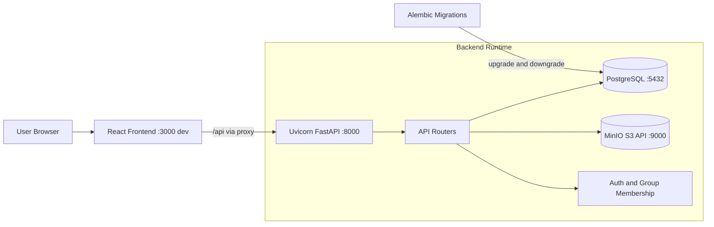

# VISTA Software System Report

This report describes the current VISTA runtime architecture and how key services (React frontend, Uvicorn/FastAPI backend, PostgreSQL, Alembic, and MinIO) work together.

## 1) System at a glance

VISTA is a web application with a browser-based React frontend, a FastAPI backend served by Uvicorn, a PostgreSQL relational database, and MinIO object storage. Schema evolution is handled through Alembic migration scripts.

## 2) Architecture diagram (infographic)

## 3) Default ports you will commonly see in `docker ps` / `podman ps`

| Service | Default container port(s) | Typical local bind examples | Notes |
| --- | --- | --- | --- |
| React frontend dev server | `3000/tcp` | `0.0.0.0:3000->3000/tcp` | Used during frontend development/HMR. |
| FastAPI backend (Uvicorn) | `8000/tcp` | `0.0.0.0:8000->8000/tcp` | Serves `/api`, `/docs`, `/redoc`. |
| PostgreSQL | `5432/tcp` | `0.0.0.0:5432->5432/tcp` | Main relational datastore. |
| MinIO S3 API | `9000/tcp` | `0.0.0.0:9000->9000/tcp` | S3-compatible object API endpoint. |
| MinIO Console UI | `9001/tcp` | `0.0.0.0:9001->9001/tcp` | Admin/browser console for MinIO. |
| pgAdmin (optional) | `80/tcp` (container) | `0.0.0.0:5050->80/tcp` | Host port is commonly remapped to avoid conflicts. |

> Note: actual **host** ports can differ if compose overrides are used; the container-side defaults above explain what developers most often see in container listings.

## 4) Component responsibilities

### React frontend
- Runs as the user-facing UI (project management, image browsing, overlays, reporting, API key screens, and group galleries).
- In development, it proxies `/api` requests to the backend (so the browser talks to one origin while API calls are forwarded to FastAPI).
- In production-style mode, backend static serving can host the built frontend assets.

### Uvicorn + FastAPI backend
- Uvicorn runs the ASGI app (`uvicorn main:app`) and handles HTTP concurrency/event loop serving.
- FastAPI registers modular routers under `/api` (projects, images, users, metadata, ML analyses, export, reviews, groups, inspection workbench, etc.).
- On startup, backend validates object storage readiness by ensuring the configured S3 bucket exists.
- Backend also provides health endpoints (`/api/health`) and OpenAPI docs (`/docs`, `/redoc`).

### PostgreSQL
- System of record for relational data: users/groups mapping, projects, image metadata, comments, classes, reviews, and other transactional entities.
- Accessed through SQLAlchemy async engine/sessions from the backend.

### Alembic
- Version-controls PostgreSQL schema changes using migration revisions in `backend/alembic/versions`.
- Migrations are intentionally manual by default in local workflows (`alembic upgrade head`) to avoid surprise schema changes.
- Alembic environment adapts async URLs to sync drivers during migration execution.

### MinIO (S3-compatible storage)
- Stores binary objects (uploaded image files and related artifacts) using S3 APIs via boto3.
- Backend initializes an S3 client, checks bucket access, and creates bucket if missing.
- Presigned URL and object operations allow file upload/download flows without storing large blobs in PostgreSQL.

## 5) How they work together (request/data flow)

1. User opens the React app in browser.
2. UI actions (load project, list images, submit comments/reviews, request ML overlays, export data) trigger HTTP calls to `/api`.
3. React dev proxy forwards calls to Uvicorn/FastAPI.
4. FastAPI route handlers:
   - read/write relational entities in PostgreSQL via SQLAlchemy,
   - read/write file artifacts in MinIO via boto3,
   - enforce auth/group access checks.
5. Backend returns JSON and/or presigned URLs; frontend renders UI updates and visual overlays.

## 6) Analyze workflow and processing output behavior

The Analyze tab provides a graph-style image processing workspace for loaded project part images. The frontend loads the toolbox manifest from `/api/analyze/toolbox`, the default project image source from `/api/projects/{project_id}/analyze/input-source`, and the saved workflow from project metadata key `vista.analyze.workflow`. Workflow validation is contract-backed, while workflow execution loads the selected image bytes from VISTA storage and runs the toolbox image-processing methods in graph order.

Current output behavior is recipe-first and non-destructive:

- Original source images are preserved and are not overwritten by processing.
- The Output block defaults to storing processed “versions” as reproducible processing-sequence metadata instead of duplicating image files.
- Simple anomaly or object detection outputs, such as bounding boxes and scores, are represented as metadata.
- Spatial outputs, such as segmentation masks, label maps, and heatmaps, are represented as overlay artifacts saved alongside the source image context.
- Fully materialized processed images are not created by default. VISTA may render/cache the selected processing version locally on demand, and can reprocess the stored sequence when a project is reopened.
- For large 3D volumes, VISTA avoids materializing repeated versions of every slice by default. The configured volume policy stores volume-level recipes with sparse artifacts and materializes selected views only when needed.
- Executed overlay artifacts are stored as `DataInstance` records, attached to the source part metadata under `source_images` and `analysis_outputs`, and rendered in Inspection as source image plus transparent Analyze overlay.

The Output block intentionally exposes only the choices an operator is likely to change:

- `mode`: default `processing_sequence`.
- `export_policy`: default `materialize_on_export`.
- `materialize_processed_images`: default `false`.

The remaining persistence decisions are built in as VISTA policy: versions use recipe metadata, artifacts are selected automatically by output type, cache is local and on demand, invalidation keys include the source/workflow/toolbox/model, provenance is full, originals are preserved, detection metadata and segmentation overlays are written when produced, measurement tables are retained, and large volume outputs use volume-level recipes with sparse artifacts. These defaults favor reproducibility, rollback safety, and storage efficiency. A user can still configure output behavior to persist overlay artifacts, emit metadata-only results, or materialize processed images when needed for reporting/export.

Current execution support runs the implemented Pillow-backed toolbox methods on actual selected image bytes. YOLOv8 blocks are explicit runtime dependencies: they report a failed node with a clear message until the optional `ultralytics` package and model runner are installed/configured.

## 7) Deployment/runtime framing

- Local infrastructure compose file defines `postgres`, `minio`, and optional `pgadmin`.
- Dev compose expands to include `backend-dev` and `frontend-dev`; backend container runs migrations then starts Uvicorn with reload.
- Frontend container uses environment variables (including backend URL) and HMR for fast iteration.

## 8) Why this split is useful

- **PostgreSQL** keeps relational consistency and queryability.
- **MinIO** handles scalable binary object storage cost-effectively.
- **Alembic** provides reproducible schema evolution across environments.
- **Uvicorn/FastAPI** offers async API performance and typed contracts.
- **React** provides responsive interactive workflows for inspection and collaboration.
