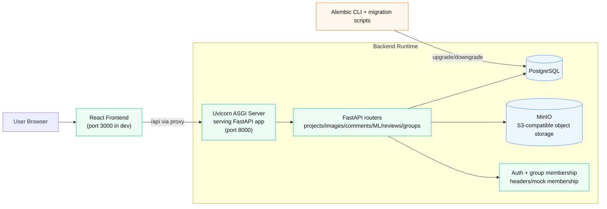

# VISTA Software System Report

This report describes the current VISTA runtime architecture and how key services (React frontend, Uvicorn/FastAPI backend, PostgreSQL, Alembic, and MinIO) work together.

## 1) System at a glance

VISTA is a web application with a browser-based React frontend, a FastAPI backend served by Uvicorn, a PostgreSQL relational database, and MinIO object storage. Schema evolution is handled through Alembic migration scripts.

## 2) Architecture diagram (infographic)

## 3) Component responsibilities

### React frontend
- Runs as the user-facing UI (project management, image browsing, overlays, reporting, API key screens, and group galleries).
- In development, it proxies `/api` requests to the backend (so the browser talks to one origin while API calls are forwarded to FastAPI).
- In production-style mode, backend static serving can host the built frontend assets.

### Uvicorn + FastAPI backend
- Uvicorn runs the ASGI app (`uvicorn main:app`) and handles HTTP concurrency/event loop serving.
- FastAPI registers modular routers under `/api` (projects, images, users, metadata, ML analyses, export, reviews, groups, inspection workbench, etc.).
- On startup, backend validates object storage readiness by ensuring the configured S3 bucket exists.
- Backend also provides health endpoints (`/api/health`) and OpenAPI docs (`/docs`, `/redoc`).

### PostgreSQL
- System of record for relational data: users/groups mapping, projects, image metadata, comments, classes, reviews, and other transactional entities.
- Accessed through SQLAlchemy async engine/sessions from the backend.

### Alembic
- Version-controls PostgreSQL schema changes using migration revisions in `backend/alembic/versions`.
- Migrations are intentionally manual by default in local workflows (`alembic upgrade head`) to avoid surprise schema changes.
- Alembic environment adapts async URLs to sync drivers during migration execution.

### MinIO (S3-compatible storage)
- Stores binary objects (uploaded image files and related artifacts) using S3 APIs via boto3.
- Backend initializes an S3 client, checks bucket access, and creates bucket if missing.
- Presigned URL and object operations allow file upload/download flows without storing large blobs in PostgreSQL.

## 4) How they work together (request/data flow)

1. User opens the React app in browser.
2. UI actions (load project, list images, submit comments/reviews, request ML overlays, export data) trigger HTTP calls to `/api`.
3. React dev proxy forwards calls to Uvicorn/FastAPI.
4. FastAPI route handlers:
   - read/write relational entities in PostgreSQL via SQLAlchemy,
   - read/write file artifacts in MinIO via boto3,
   - enforce auth/group access checks.
5. Backend returns JSON and/or presigned URLs; frontend renders UI updates and visual overlays.

## 5) Deployment/runtime framing

- Local infrastructure compose file defines `postgres`, `minio`, and optional `pgadmin`.
- Dev compose expands to include `backend-dev` and `frontend-dev`; backend container runs migrations then starts Uvicorn with reload.
- Frontend container uses environment variables (including backend URL) and HMR for fast iteration.

## 6) Why this split is useful

- **PostgreSQL** keeps relational consistency and queryability.
- **MinIO** handles scalable binary object storage cost-effectively.
- **Alembic** provides reproducible schema evolution across environments.
- **Uvicorn/FastAPI** offers async API performance and typed contracts.
- **React** provides responsive interactive workflows for inspection and collaboration.
